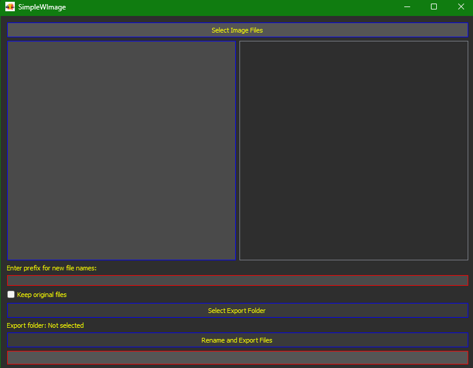

# SimpleWImage by Iván Ayub

This program is designed for photographers, designers, and anyone needing to organize and label their image files efficiently. SimpleWImage provides a seamless experience for managing large image collections with ease.

---

## Download
[Click here to download the EXE application (.zip)](https://drive.google.com/file/d/1u3Y3rU6pkpwbS9q2k5lGKh2Hi6l1v5IQ/view?usp=sharing)

For inquiries or feedback, contact me at: [sellocasadenubes@gmail.com](mailto:sellocasadenubes@gmail.com).

---

## Description
SimpleWImage is a desktop application developed in Python to streamline renaming and organizing image files. Its intuitive interface and robust features make it ideal for photographers, designers, and anyone working on multimedia projects.

---

## Features
- **Batch File Selection:** Import multiple image files, including popular formats such as .png, .jpg, .jpeg, .bmp, and .gif.
- **Visual Preview:** Review thumbnails of selected images for easy identification.
- **Customizable Renaming:** Append a prefix and add sequential numbering to file names.
- **Export Flexibility:** Save renamed files to a folder of your choice.
- **File Safety:** Preserve the original files if desired.
- **Real-Time Progress Updates:** Monitor renaming and exporting progress via a progress bar.

---

## How to Use
1. Launch the application.
2. Select image files for renaming.
3. Enter a custom prefix for new file names.
4. Choose an output folder for renamed files.
5. (Optional) Check the "Keep original files" option if you want to retain the originals.
6. Click "Rename and Export Files" to begin the process.
7. Monitor the progress and wait for the completion notification.

### Example Scenario
You’re a professional photographer managing a folder with 500 images from a wedding shoot. SimpleWImage enables you to:
- Add a descriptive prefix like "Wedding_2024_" to all images.
- Automatically number the files sequentially (e.g., "Wedding_2024_001.jpg").
- Export renamed files to a project-specific directory while keeping the original files intact for backup.

---

## Captures

---

## Application Structure
The program is divided into key components:

1. **Main Interface (UI):** Built using PyQt5, it handles user interactions, file selection, and operation triggers. Includes buttons, input fields, and a preview area.
2. **File Handler:** Manages operations such as image loading, renaming, and exporting to the designated folder.
3. **Image Previewer:** Displays thumbnails of selected images for easy visual confirmation.
4. **Progress Tracker:** Implements a progress bar for user feedback during renaming and exporting.
5. **Error Management:** Catches and displays errors like unsupported formats or invalid paths to ensure smooth operation.

---

## System Requirements
- **Operating System:** Windows
- **Dependencies:**
  - Python 3.x
  - PyQt5

---

Enjoy using SimpleWImage for your image management tasks! Feel free to share your feedback and suggestions.
